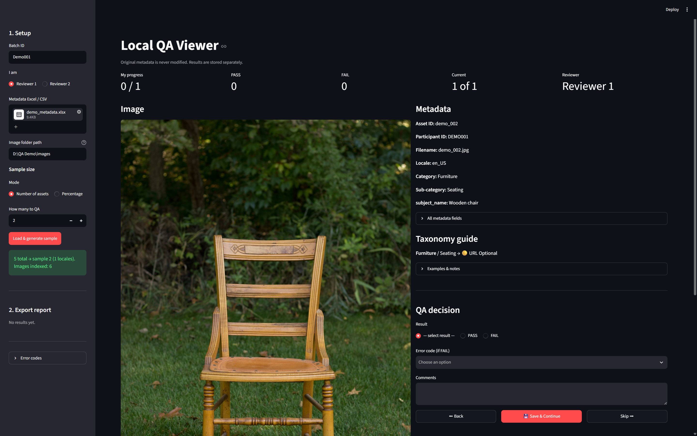
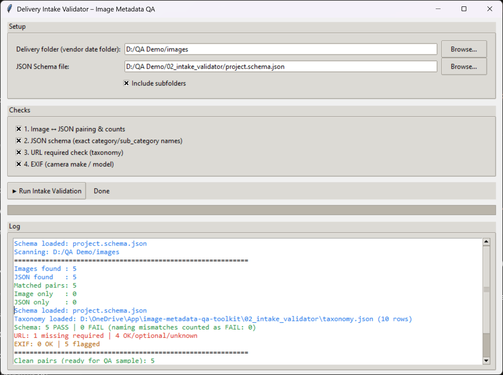

# Image + Metadata QA Toolkit

Local tooling for **large-scale image collection QA and delivery**.

Designed for pipelines where vendors submit photos + JSON metadata, and the ops team needs to validate, sample-review, clean, and package data before upload.


## Screenshots

### QA Viewer


### Intake Validator


---

## Problem

Manual QA on thousands of image + metadata pairs is slow:

* Constant switching between spreadsheets, folders, and image viewers
* Schema / naming issues caught too late
* URL and taxonomy rules applied inconsistently
* Delivery folder structures built by hand

## Solution

Four local tools covering the delivery lifecycle:

```
Vendor delivery folder
        │
        ▼
┌─────────────────────┐
│  Intake Validator   │  pairing · schema · naming · URL · EXIF
└─────────────────────┘
        │
        ▼
┌─────────────────────┐
│  QA Viewer          │  sampling · dual reviewers · side-by-side review
└─────────────────────┘
        │
        ▼
┌─────────────────────┐
│  Delete Rejected    │  remove failed image+JSON pairs
└─────────────────────┘
        │
        ▼
┌─────────────────────┐
│  Delivery Packager  │  structured folders + batch metadata
└─────────────────────┘
```

---

## Tools

| Folder | Tool | Description |
|--------|------|-------------|
| [01_qa_viewer](01_qa_viewer/) | **QA Viewer** (Streamlit) | Load metadata + images; sample for QA; two-reviewer assignment; image and metadata side-by-side; taxonomy guide; PASS/FAIL + error codes; CSV export |
| [02_intake_validator](02_intake_validator/) | **Intake Validator** (Tkinter) | Image↔JSON pairing, JSON Schema validation, exact enum names, URL required/optional checks, basic EXIF flags |
| [03_delivery_packager](03_delivery_packager/) | **Delivery Packager** (Tkinter) | Build nested delivery folders and external batch metadata for upload |
| [04_delete_rejected](04_delete_rejected/) | **Delete Rejected** (Tkinter) | Delete rejected pairs from a filename list or QA export |

---

## Quick start

```bash
git clone https://github.com/deepaukk/image-metadata-qa-toolkit.git
cd image-metadata-qa-toolkit

python -m venv .venv
# Windows: .venv\Scripts\activate
source .venv/bin/activate

pip install -r requirements.txt
```

```bash
# QA Viewer
cd 01_qa_viewer && streamlit run app.py

# Intake Validator
cd 02_intake_validator && python Delivery_Intake_Validator.py

# Packager
cd 03_delivery_packager && python delivery_packager_gui.py

# Delete rejected
cd 04_delete_rejected && python Delete_Rejected_Assets.py
```

Windows: use the `.bat` files in each folder.

---

## Skills shown

* QA process design (sampling, dual review, rejection codes)
* Data validation (JSON Schema, enums, EXIF, URL policy)
* Ops tooling (Tkinter desktop apps + Streamlit visual QA)
* Delivery packaging (deterministic folder layouts)

---

## Notes

* Runs **locally** — no cloud required for QA
* `taxonomy.json` and `project.schema.json` are **synthetic demo files** only (not from any client project). Replace them for real work.
* Do not commit real deliveries, credentials, or personal data

---

## Author

**Deepauk** · [github.com/deepaukk](https://github.com/deepaukk)
